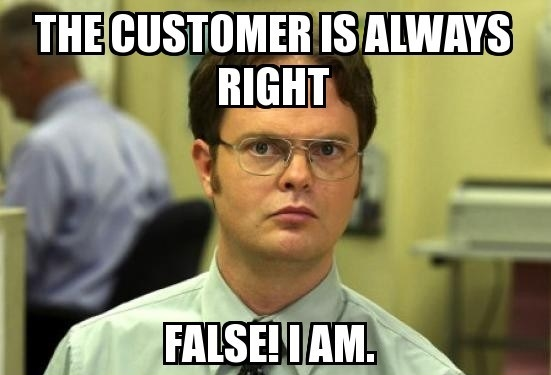

# Casting a Wider .NET

#### Moving .NET Toward Greater OSS Maturity

[WiderDotNet.SeanKilleen.com](https://WiderDotNet.SeanKilleen.com)

---

<!-- _footer: "" -->

# <!--fit--> Hi! :wave: I'm Sean

- :bird: [sjkilleen](https://twitter.com/sjkilleen)
- :earth_americas: [SeanKilleen.com](https://seankilleen.com)
- :briefcase: [Excella](https://excella.com)

---

---

## Standing on the Shoulders of Giants

---
<!-- _footer: "" -->

---

---
<!-- _footer: "" -->

---
<!-- _footer: "" -->

---
<!-- _footer: "" -->

<!--#### We're dealing with 
# Cultural Debt-->

---

#### How do we tackle it?

# Empathy

---

---

## Let's apply this to culture

---

## So, how do we capture this?

---

## A maturity model

---
<!-- _footer: "" -->

---

# The Model

---

#### The Model

# FUD

---

#### FUD

# Mistrust

---

#### FUD

# Security

---

#### FUD

# Legal

---

#### FUD

# Reinventing the Wheel

---

#### FUD

# We're the best ...right?

---

#### The Model

# Acceptance

---

#### Acceptance

# OSS As Mystery

---

#### Acceptance

# Learning "The Moves"

---

#### The Model

# Consumption

---

#### Consumption

# Using Packages

---

#### Consumption

# Understand the ecosystem

---

#### Consumption

# OSS AS MAGIC

---

#### Consumption

# Responsible Consumption

---
<!-- _footer: "" -->

---

#### The Model

# Contribution

---

#### Contribution

# Pull Requests

---

#### Contribution

# OSS as two-way street

---

#### The Model

# Participation

---

#### Participation

# OSS by Default

---

#### Participation

# Public Code

---

#### Participation

# Encourage Contributions

---

#### Participation

# Incentivize Contributions

---

#### The Model

# Cultural Embrace

---

#### Cultural Embrace

# Avoiding NIH Syndrome

---

#### Cultural Embrace

# Public Roadmap

---

#### Cultural Embrace

# Community Direction

---

#### Cultural Embrace

# Collaborate by Default

---

#### Cultural Embrace

# Maximally Open

---
<!-- _footer: "" -->

---

#### FUD :arrow_right: Acceptance

# Explain Risks

---

#### FUD :arrow_right: Acceptance

# Explain Advantages

---

#### FUD :arrow_right: Acceptance

# License FAQs

---

#### FUD :arrow_right: Acceptance

# Success Stories

---

#### FUD :arrow_right: Acceptance

# Mythbusting

---

#### Acceptance :arrow_right: Consumption

# Package Managers

---

#### Acceptance :arrow_right: Consumption

# Reponsible Consumption

---

#### Acceptance :arrow_right: Consumption

# OSS Maintainer Empathy

---

#### Consumption :arrow_right: Contribution

# Git &amp; Platform fundamentals

---

#### Consumption :arrow_right: Contribution

# [Up-for-grabs.net](http://up-for-grabs.net)

---

#### Consumption :arrow_right: Contribution

# The "Why"

---

#### Contribution :arrow_right: Participation

# Guide to OSSing software

---

#### Contribution :arrow_right: Participation

# ROI of participation

---

#### Contribution :arrow_right: Participation

# Ways to Encourage Contributions

---

#### Contribution :arrow_right: Participation

# Ways to Incentivize Contributions

---

#### Participation :arrow_right: Cultural Embrace

# Commit to "collaboration first"

---

#### Participation :arrow_right: Cultural Embrace

# Take feedback on NIH seriously

---

#### Participation :arrow_right: Cultural Embrace

# Examples of Public Roadmap

---

#### Participation :arrow_right: Cultural Embrace

# Examples of Community Driven OSS

---

#### Participation :arrow_right: Cultural Embrace

# Open Governance Models

---

#### Introducing

# [AWider.NET](http://AWider.net)

---
<!-- _footer: "" -->

---
<!-- _footer: "" -->

---

<!-- _footer: "" -->

# <!--fit--> Thanks

- :bird: [sjkilleen](https://twitter.com/sjkilleen)
- :earth_americas: [SeanKilleen.com](https://seankilleen.com)
- :briefcase: [Excella](https://excella.com)
